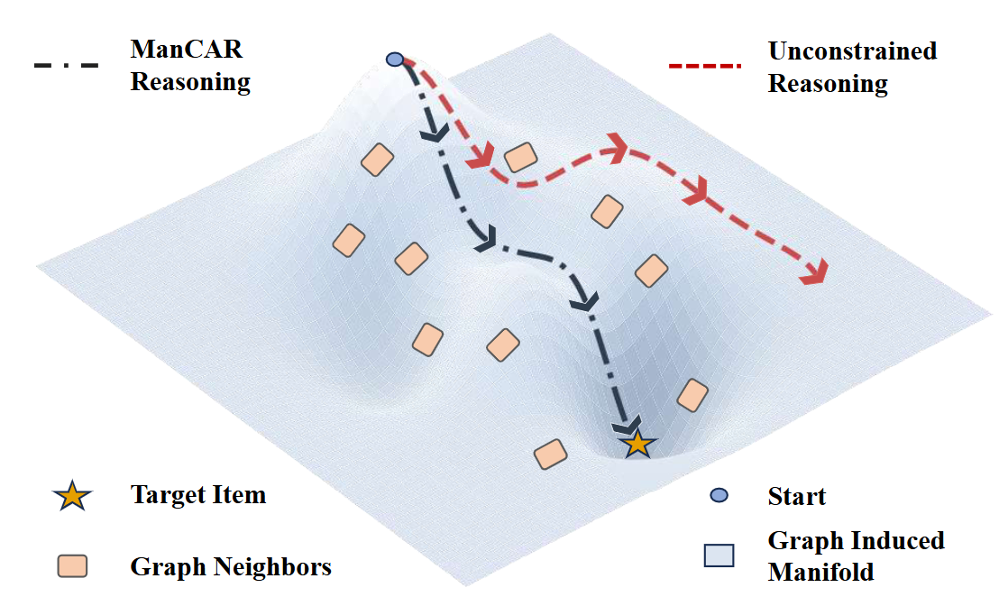
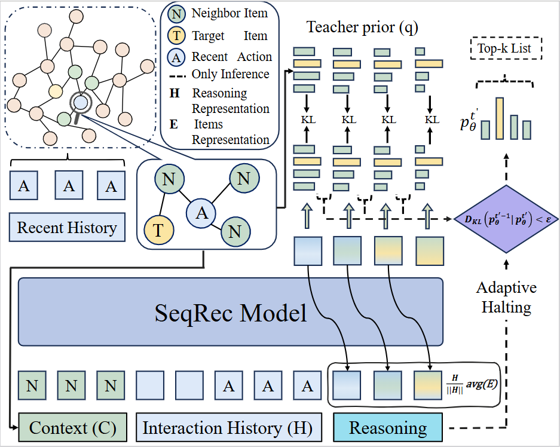
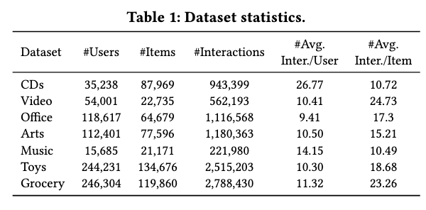
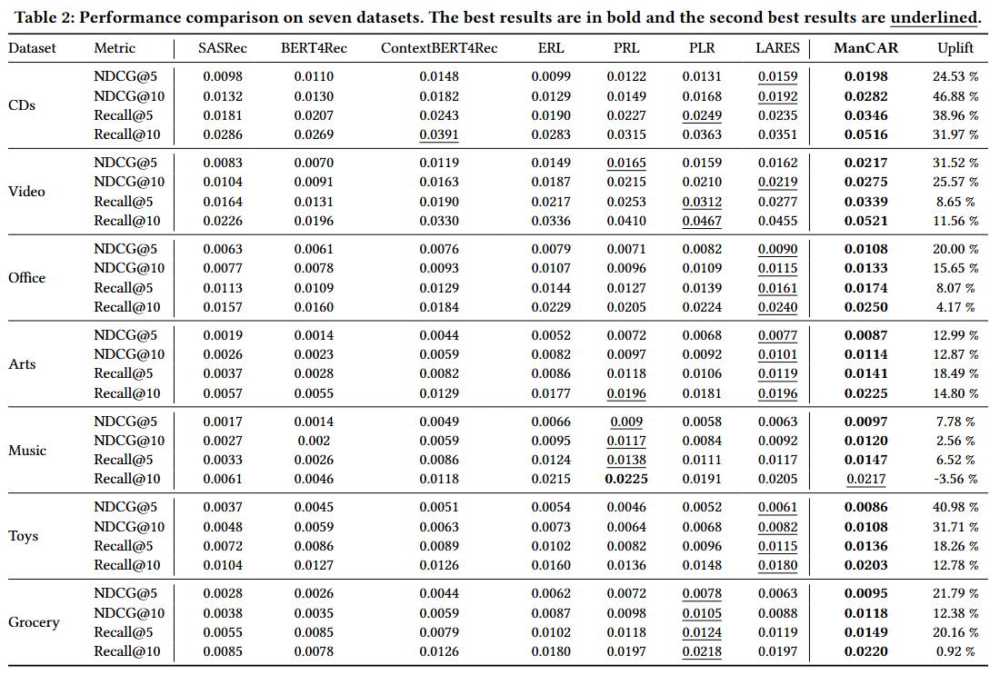

# ManCAR

This repository provides a PyTorch reference implementation of the main models and training procedures described in our paper:

> Kun Yang, Yuxuan Zhu, Yazhe Chen, Siyao Zheng, Bangyang Hong, Kangle Wu, Yabo Ni, Anxiang Zeng, Cong Fu, Hui Li.  **ManCAR: Manifold-Constrained Latent Reasoning with Adaptive Test-Time Computation for Sequential Recommendation**.


## Overview



we propose **ManCAR**, a principled framework that grounds reasoning within the topology of a global interaction graph. ManCAR constructs a **local intent prior** from the collaborative neighborhood of a user's recent actions, represented as a distribution over the item simplex. During training, the model progressively aligns its latent predictive distribution with this prior, forcing the reasoning trajectory to remain within the **valid manifold**. At test time, reasoning proceeds adaptively until the predictive distribution stabilizes, avoiding over-refinement.




## Paper & Resources

- Hugging Face Papers:  https://huggingface.co/papers/2602.20093
- arXiv: https://arxiv.org/abs/2602.20093
- Dataset (Hugging Face): https://huggingface.co/datasets/PIIR/ManCAR

## Dataset process

you can download CDs dataset from [Hugging Face](https://huggingface.co/datasets/PIIR/ManCAR)

After downloading the dataset, you need put the dataset into `dataset/processed/`.

or use the following commands to process your datasets

1. Download the dataset from [Amazon](https://amazon-reviews-2023.github.io/)

2. python ./datasets/process_data.py

3. python ./datasets/item_csv.py

After processed, you need to put the processed dataset into `dataset/processed/`.



## Requirements
torch==2.4.1

numpy

tqdm

## Training
To run ManCAR, use the following command:

1. cd ManCAR
2. bash run.sh


## Results




## Acknowledgements

We greatly appreciate the official [ReaRec](https://github.com/TangJiakai/ReaRec) repository. Our code is based on the ReaRec repository.

## Citation

If you use this dataset, please cite:

```bibtex
@article{mancar2026,
  title={ManCAR: Manifold-Constrained Latent Reasoning with Adaptive Test-Time Computation for Sequential Recommendation},
  author={Kun Yang, Yuxuan Zhu, Yazhe Chen, Siyao Zheng, Bangyang Hong, Kangle Wu, Yabo Ni, Anxiang Zeng, Cong Fu, Hui Li},
  journal={arXiv preprint arXiv:2602.20093},
  year={2026}
}
